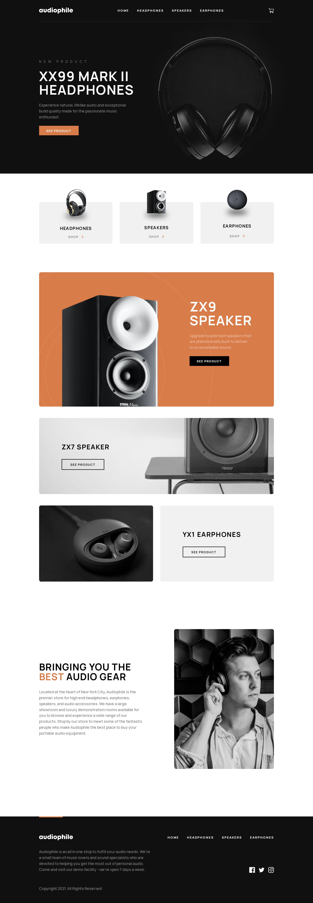

# Audiophile Website

A dynamic e-commerce website showcasing a diverse range of products across multiple pages, fully optimized for a seamless user experience on any device. Built with Next.js.

## Overview

### Features

Audiophile Website offers the following features to enhance the user experience:

- **Responsive Design**: The layout adapts seamlessly to different screen sizes and devices.
- **Cart Management**: Effortlessly add or remove products from the shopping cart, edit quantities, and preserve cart contents even after a browser refresh using `localStorage`.
- **Efficient Checkout**: A user-friendly checkout process with form validations using `React Hook Form` ensures a smooth shopping experience.
- **Order Confirmation Modal**: After checkout, users receive an order summary in a convenient modal.

### Live Site

Visit the live site to explore the Audiophile Website:
[Live Site URL](https://audiophileonline.store/)

### Technologies Used

- [TypeScript](https://www.typescriptlang.org/)
- [Next.js](https://nextjs.org/)
- [React Hook Form](https://react-hook-form.com/)
- SCSS Modules

## Author

- [viktorpatrin.com](https://viktorpatrin.com/)
